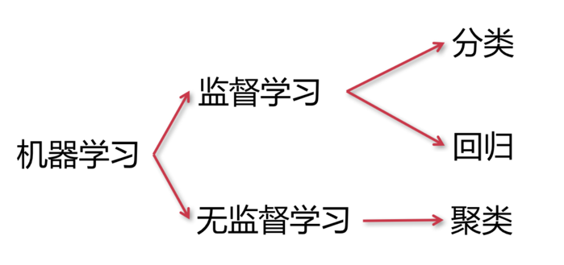

# machine_learning
机器学习demo

## data_acquisition
数据收集

## data_processing
数据处理

## modelling
建立模型

## model_evaluation
模型评估

三把金钥匙
模型：用于作出决策，O=f(w;x)
输入值x得到预测值O

策略：用于评价决策，L(w)=loss(O,Ô)
预测值O与实际值Ô的偏差

算法：用于修正模型，w=argmin(L(w))/w
调整参数使偏差不断降低

* 分类问题

  精准率、召回率、F1值，ROC、AUC

* 回归问题
  
  MAE、MAPE、RMSE
